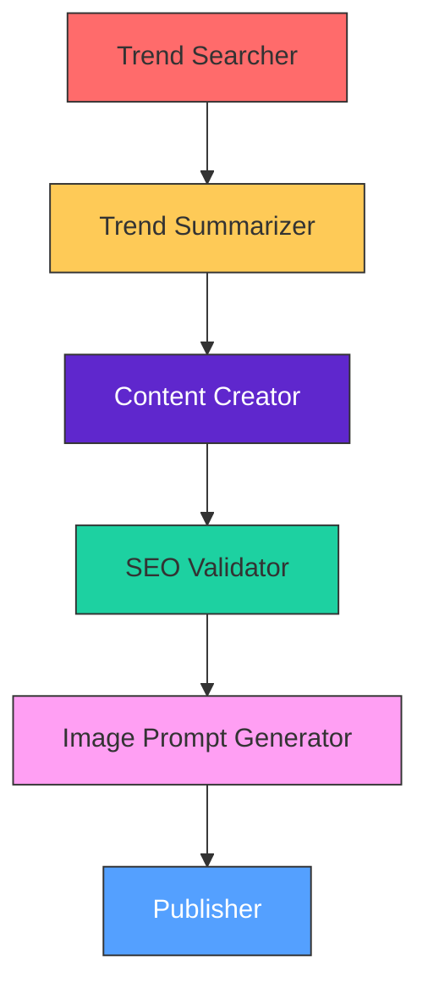

# AI Content Generation Pipeline

## Flowchart Overview


---

## Agent Specifications

### 1. Trend Searcher
- **Purpose**: Identify trending topics
- **Tools**: 
  ```python
  # Example API Call
  pytrends = GoogleTrends(geo='EG')  # Egypt-focused trends
  trends = pytrends.daily_searches()
  ```
- **Output**: List of 5 trending keywords with search volumes

### 2. Trend Summarizer
- **Input**: Raw trend data
- **Processing**:
  ```python
  def summarize(trend_data):
      return NextaX.generate(
          f"Summarize in 3 bullet points:\n{trend_data}",
          max_length=150
      )
  ```
- **Output**: Key insights (Markdown formatted)

### 3. Content Creator (NextaX)
- **Prompt Template**:
  ```text
  "Create {content_type} about {trend}:
  - Tone: {professional/casual}
  - Length: {300 words}
  - SEO Keywords: {kw1, kw2}
  - Include: Call-to-action"
  ```
- **Output**: Blog post/social media content

### 4. SEO Validator
- **Checks**:
  - ✅ Keyword density (2-3%)
  - ✅ Readability score (>80)
  - ✅ Meta description length (50-160 chars)
- **Tools**: 
  ```bash
  python -m seo_analyzer --text "content.txt" --lang ar
  ```

### 5. Image Prompt Generator


### 6. Publisher

